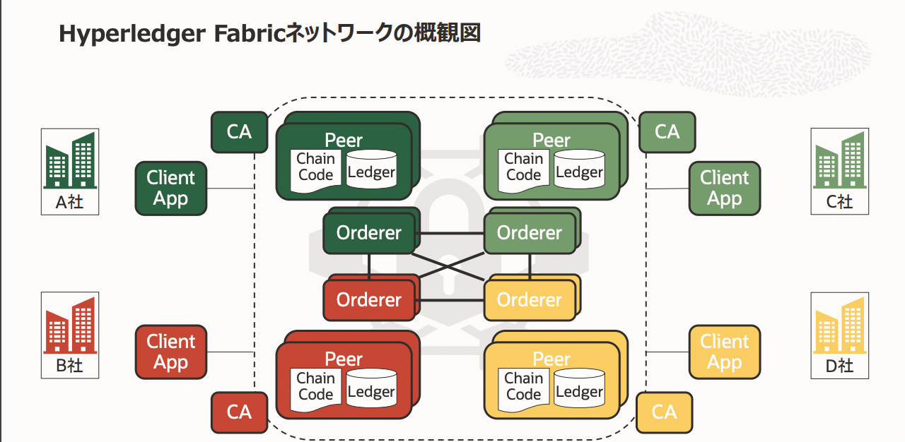
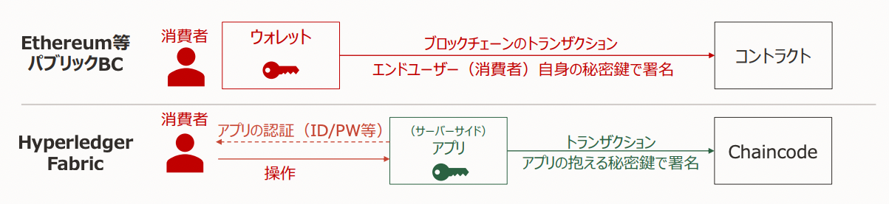

# 概要

Hyperledger Fabric(HLF) は エンタープライズ用途を目的として開発されたブロックチェーンです。

HLF をより正確に説明すると Linux 財団がホストするオープンなコミュニティである Hyperledger が管理するエンタープライズ領域汎用用途のためのブロックチェーン基盤の Fabric です。

HLF はクローズドなブロックチェーンネットワークを構築します。

HLF は基盤でセキュリティ、機密性/プライバシーを強化するための多様な機能を備えており、メンバー管理サービスもその中に含まれます。

HLF の Chaincode は ETH のスマートコントラクト(SC)に該当し、基盤でメンバー管理サービスを有するため、SC よりもシンプルな実装で業務の自動化が可能です。

一般的なブロックチェーン基盤とは異なるトランザクションフローを有しており、基盤が有する機能も多いため、ETH をベースとして理解しようとすると混乱することもあるため、ゼロベースで理解していくことが推奨されます。

HLF の多くの機能や独特の仕様には、以下のような目的、背景があると考えると全体として理解しやすくなります。

- 複数の企業／組織から成るコンソーシアム型のユースケースに最適化する
- ネットワークの中で更にデータ共有範囲を分割／制御する
- 重大なオペレーションの安全かつ分権したガバナンスを実現する
- 耐障害性と可用性をブロックチェーン基盤の機能として確保する
- ネットワークメンバー数とトランザクション処理能力のスケーラビリティを確保する

# ネットワーク外観

下記が HLF のネットワークの外観図です。



## Organization

HLF にはネットワークに参加する主体（多くの場合は企業などの組織の単位、時には個人）を表現するための抽象アイデンティティレイヤーである Organization（Org）があります。

Org は CA、Orderer ノード、Peer ノード、アプリケーションが用いるユーザーのアイデンティティを有します。また、各ノードやユーザアイデンティティは必ずいずれか一つの Org に所属します。

HLF ではどの Org 配下のコンポーネント/ユーザーか基づいて権限制御を行います。

また、自身の Org 配下のコンポーネントやユーザー用の秘密鍵／証明書は自身の CA で発行します。

CA で発行された秘密鍵で行われたデジタル署名の検証は、各コンポーネントの持つ Membership Service Provider(MSP)が行います。

## トランザクションへの署名

ETH 等の 一般的なパブリックチェーンでは基本的に エンドユーザーが自身の秘密鍵を用いてトランザクションに署名し発行します。従って、エンドユーザーは何らかの方法で自身の秘密鍵を管理する必要があり、ブロックジェーン上の公開鍵も意識する必要があります。

一方で、HLF では通常、個々の消費者に対してはブロックチェーン上の ID を割り当てません。トランザクションに署名し発行するのはサーバーなどの中間オペレータになります。

エンドユーザーはアプリにログインするための認証のみ管理します。



HLF では必要に応じてロールベースや属性ベースのオンチェーン権限制御ロジックを実装します。

これは ETH のコントラクトウォレットの概念や web3auth などが行っていることに近いです。web3auth は秘密鍵をユーザーデバイス、Torus Network、運営の 3 つに分散して管理していますが、HLF はサーバーのみで管理しています。

## Chaincode

Chaincode は一般のパブリックブロックチェーンではいわゆるスマートコントラクトに該当します。

ただし、HLF では基盤が認証認可等を管理しているため、Chaincode 側で行うロジックはそこまで多くありません。

Chaincode は各々が自身の Peer に Install した後、Channel で有効化することで実行可能になります。また、稼働後もバージョンアップを行い修正や改善が可能です。

## HLF における台帳

HLF の台帳は BlockChain と WorldState の 2 つのストレージから構成されます。

BlockChain は一般のパブリックブロックチェーンと同じく、トランザクションの履歴をハッシュチェーンを連結させたブロックとして蓄積しています。

World State はキーバリューストア(KVS)のようにデータを HLF 上に保存します。World State は State DB と呼ばれる DB に格納されます。World State は更新・削除可能ですが、BlockChain 上に変更履歴が保存されます。

State DB は　 Level DB と Couth DB を選択可能です。

Level DB は Value に数字や文字列などシンプルな情報を保存し処理速度は比較的早いものの、Key によるステート検索しかできません。Couch DB は JSON 形式で値を保存でき、JSON の Attribute を条件にして検索ができますが、低速です。

# トランザクションフロー

HLF の公式ドキュメントでは、コンセンサスアルゴリズムという言葉は用いずにトランザクションフローという言葉を用いているため、本資料もそれに倣います。

HLF のトランザクションフローは Endorsement・Ordering・Validation の 3 フェーズから構成され、それぞれの役割は下記の通りです。

- Endorsement：トランザクションの内容について合意する
  - クライアントアプリケーションから Peer に Chaincode 実行依頼（Transaction Proposal）を送付
  - Peer ノードが Chaincode を実行し署名を付けて結果（Endorsement）を返却、この時点ではコミットしない。
  - クライアントは Endorsement Policy で定められた必要な分の Endorsement を収集する
- Ordering：トランザクションの順序を確定しブロックを生成・配布する
  - Endorsement を集め終えたクライアントアプリケーションが Transaction を送付
  - 受け取った Ordering Service が Transaction を詰めた Block を生成、Peer ノードに配布
- Validation：トランザクションの有効性を検証したうえで反映する

  - Peer がブロック内の Transaction を検証し台帳に反映（コミット）

  

上記の 3 フェーズに分けることで、処理の重い Chaincode の実行を Peer ノードに、トランザクション順序の決定とブロック生成を Ordering Service に分離することができ処理能力が向上する。

また、Endorsement Polkcy 次第でネットワーク拡大がコントラクトロジック実行の処理負荷増大に直結しない。

## Endorsement フェーズ

別の組織が所有する複数の Peer で同一の Chaincode を実行し、同一の結果になることを担保する。この時点ではコミットしないため、シミュレーション実行とも呼ばれる。

トランザクションを反映するために必要な条件を Endorsement Policy として次戦に定義しておく必要がある。なお、Endorsement は Organization 単位でカウントされる。

```
Endorsement Policyの例

AND(‘Org1.member’, ‘Org2.member’, ‘Org3.member’) // 全Org必須

OR(‘Org1.member’, ‘Org2.member’) // Org1かOrg2どちらかひとつ

OutOf(2, ‘Org1.member’, ‘Org2.member’, ‘Org3.member’) // いずれか2つ
```

シミュレーション実行の Before/After の状態セットは Read-Write-Set(RWSet)と呼ばれ、

- Read-Set：そのトランザクションが前提とした台帳の状態（使用した World State の値）
- Write-Set：そのトランザクションが有効となった場合に書き込む値（変更した World State の値）

下記は Version 情報を簡易化した RWSet の例

```
<TxReadWriteSet>
    <NsReadWriteSet name="chaincode1">
        <read-set>
            // Versionは簡易化している。
            <read key="K1", version="1">
            <read key="K2", version="1">
        </read-set>
        <write-set>
            <write key="K1", value="V1”>
            <write key="K3", value="V2”>
            <write key="K4", isDelete="true" >
        </write-set>
    </NsReadWriteSet>
<TxReadWriteSet>
```

## Ordering フェース

Endorsement を集め終えたクライアントアプリケーションが Transaction を送付し、受け取った Ordering Service が Transaction を詰めた Block を生成して Peer に配布する。

Ordering Service は 1~複数の Orderer ノードからなるクラスタで、この中にもコンセンサスがある。このクラスターの中で受け取った Transaction の順序を合意し決定している。コンセンサスアルゴリズムは設定可能で、Raft は Orderer Service で選択できるコンセンサスアルゴリズムの代表的なものの一つ。

## Validation フェーズ

Orderer から配布されたトランザクションの有効性を各 Peer はこのフェーズで検証する。具体的には

- Endorsement Policy を満たしているか（含：各 Endorser の戻した RWSet の比較）
- 各署名（クライアント、Endorser、Orderer）は正しいか
- Read-Set Validation：Read-Set に含まれる Key のバージョンが自身の現在の World State のそれと一致
  しているか

問題なければ Write-Set の値を World State に反映し、BlockChain 部分にも保存します。

HLF ではトランザクションの中で State を Read する時点と Write/Read する時点が離れており、その間もロックしていないため、他のトランザクションなどにより Read set が書き換えられる場合がある。その場合はトランザクションを無効にします。

# Channel と Private Data

エンタープライズ領域ではあるデータをネットワークのうち一部の参加者にしか見せたくないというニーズが頻出します。このニーズに応えるため、HLF には Channel と Private Data の 2 つの機能を提供しています。

Channel はネットワークをサブネットワークに分割し、トランザクションそのものの共有範囲を限定します。ある Channel にはネットワークのうち一部または全部のノードが参加しており、Channel ごとに台帳が存在し、Channel ごとにトランザクションが実行されます。

Private Data は Channel 内で共有されるトランザクションのうち、一部のデータ項目をさらに範囲を限定して共有する機能です。Private Data を格納する入れ物は Private Data Collection (PDC)と呼ばれ、World State とは別の領域の KVM として State DB 内に保存されます。

Chaincode の中で利用する PDC は、Chaincode を Channel で稼働させる際に定義（宣言）する必要があります。この中で、Channel のメンバーのどの Org が PDC を保持するかを設定します。

PD の内容をハッシュ化したもの(Private Data Hash: PDH)は PDC 保持メンバーにも共有され、PDH はトランザクションに載り、World State にも格納されます。

# 単語帳

| 用語                         | 説明                                                                                                                                                                                         |
| ---------------------------- | -------------------------------------------------------------------------------------------------------------------------------------------------------------------------------------------- |
| Organization                 | ネットワークに参加するメンバーの「組織」を表す抽象的な単位。 コンポーネントやユーザーが所属 。                                                                                               |
| Peer ノード                  | 台帳（World State と Blockchain）を保持。 Chaincode をリクエストに応じて実行する。                                                                                                           |
| Orderer ノード               | ひとつ～複数の Orderer ノードで Ordering Service を構成。 トランザクションの順序を確定し、ブロックを生成し Peer ノードに配布 。                                                              |
| Chaincode                    | 台帳の更新、照会のビジネスロジック。ETH でいうスマートコントラクト。                                                                                                                         |
| クライアントアプリケーション | Hyperledger Fabric を利用するアプリ。                                                                                                                                                        |
| CA                           | 各コンポーネントやユーザーのアイデンティティ（証明書）を発行する PKI の認証局。 通常、Fabric CA を利用するが他の実装も利用可能。                                                             |
| Membership Service Provider  | 秘密鍵で行われたデジタル署名の検証を行う HLF のモジュール。                                                                                                                                  |
| トランザクションフロー       | HLF の公式ドキュメントで利用されている用語で、一般のパブリックチェーンのコンセンサスアルゴリズムの概念に近い。HLF では Endorsement, Ordering, Validation の 3 フェーズによって成立している。 |
| Endorsement                  | Chaincode 実行結果に Peer が署名したもの                                                                                                                                                     |
| Endorsement Policy           | あるトランザクションを台帳に反映するために必要な Endorsement の条件を記述したもの。                                                                                                          |
| RWset                        | Chaincode を実行するために理容師た World State の値（Read set）と実行により変更が加わる値(Write set)の組み合わせ。                                                                           |
| Ordering                     | トランザクションの順序を確定し、ブロックを生成・配布する。Ordering Service は 1 以上のクラスタを構成しており、中でコンセンサスを取る必要がある。                                             |
| Validation                   | RWset の値検証や Endorsement Policy を満たしているかなど、BlockChain に永続化する前の最終確認を行う。                                                                                        |
| Commit                       | 　有効な Transaction の Write-Set をい WorldState に反映し、Block、Transaction の内容及びメタデータを Blockchain 部に保存する。                                                              |

# 参考文献

[Hyperledger Fabric（再）入門](https://speakerdeck.com/gakumura/blockchain-gig-number-9-hyperledger-fabric-zai-ru-men?slide=16)

ORACLE のエンジニアが作ってくれたスライド。概要がとてもよくわかる。

[分散合意アルゴリズム Raft を理解する](https://qiita.com/torao@github/items/5e2c0b7b0ea59b475cce)
