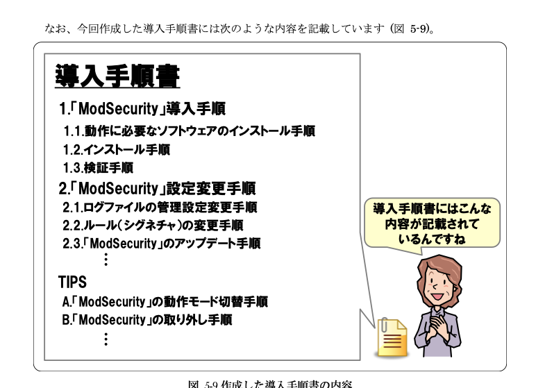

# 概要

AWS WAF の導入を検討することがあったので、ナレッジをここにまとめようと思いました。

[1] [IPA/Web Application Firewall 読本](https://www.ipa.go.jp/archive/security/vuln/waf.html) の `4章：WAF導入におけるポイント` の中で具体的に AWS WAF の場合に気を付けるところは？という観点でまとめています。

WAF とは何かとか、基本的なことは既知の人向けになります。

この資料に記載された内容を流用したことにより損害が生じても、責任は負いません。

# 検討事項

## 導入

`4.1. 導入判断` および `4.2. 導入` で気を付けたポイントは料金と防御対象です。

### 料金

AWS WAF は次のようにルールの数による固定費 + リクエスト数に応じた変動費に分けられます[3]。

AWS WAF は既存の AWS リソースに関連付けるだけなので、その他にインフラ費用はかかりません。

DNS の設定変更も不要です。検証などの人件費は別でかかります。

| リソースタイプ               | 料金                                                                               |
| ---------------------------- | ---------------------------------------------------------------------------------- |
| Web ACL                      | USD 5.00、月あたり (時間で案分)                                                    |
| ルール                       | USD 1.00、月あたり (時間で案分)                                                    |
| リクエスト                   | USD 0.60/100 万件のリクエスト (最大 1500 WCU およびデフォルトの本文サイズの検査\*) |
| Bot Control と Fraud Control | 上記のタブによる追加費用                                                           |

（2024/08/23 時点　東京リージョン）

リクエスト数に応じた変動費が存在するので、DDoS 攻撃を受けた際に料金が急増する可能性がありますが、AWS Shield Standard がある程度保護してくれるので、おそらく高くなりすぎることはないです。

変動費の申請が難しい場合は、AWS WAF は候補から外れますが、変動費含めても AWS WAF の方が他のサブスク型の WAF より安いと思います。

### 防御対象

AWS WAF は自分たちでどのルールを使うかを設定する必要があります。

とりあえず次の 4 つを設定しておけば良いと思います。

怪しい IP からの攻撃と OWASP Top 10 の内容、SQL インジェクション、既知の攻撃手法といったよくある攻撃から守ってくれます。

- AWS-AWSManagedRulesAmazonIpReputationList
- AWS-AWSManagedRulesAnonymousIpList
- AWS-AWSManagedRulesCommonRuleSet
- AWS-AWSManagedRulesSQLiRuleSet
- AWS-AWSManagedRulesKnownBadInputsRuleSet

これらに追加して、例えば WordPress を使っているなら`AWS-AWSManagedRulesWordPressRuleSet`、Linux を使っているなら`AWS-AWSManagedRulesLinuxRuleSet` といったふうに追加すれば大体 OK だと思っています。

AWS WAF のマネージドルールの変更ログは [4] で確認できます。

MarketPlace で販売されているサードパーティのルールもありますが、変更履歴や検知ルールがわからず、AWS のマネージドルールより何が優れているのかあまり分かりませんでした。

よくわからないものにお金はかけたくないので、今回検討した範囲では MarketPlace のルールの採用は見送りましたが、もしかしたら入れた方が良いかもしれません。

## 運用計画

[1] の `4.2.3. 運用計画` で調べたポイントをまとめます。

### ログの運用

AWS WAF は S3 に直接ログ出力が可能です[5]。


Kinesis Data Firehose を使っている記事も時々ありますが、2021 年から S3 に直接出力が可能になっているので特段の理由がなければ直接出力が楽です[6]。

S3 に出力したログは Athena で解析します。Athena テーブル作成のための情報は [7] にまとまっていました。

このテーブルにクエリを流してログ検索を行います。

WAF のアクセスログをログアーカイブ用アカウントに保存して運用する場合、Athena テーブルのパーティションに AWS アカウント ID やリージョン、 webacl の名前なども追加すると便利です。

### 検出パターンの更新

ログを検索して、偽陽性/偽陰性を検索するフローになります。

特に偽陽性はエンドユーザーに影響が大きい場合があるので、ちゃんと調べます。

[8] にある偽陽性のいくつかは自分が検証した時も確認できました。

| ルール名              | 説明                                                                         | 偽陽性ケース                                     |
| --------------------- | ---------------------------------------------------------------------------- | ------------------------------------------------ |
| SizeRestrictions_BODY | リクエストボディが大きい場合                                                 | ファイルアップロードなど                         |
| SQLi_Cookie           | cookie に SQL インジェクションと思しき値がある場合                           | アクセストークンを cookie で管理しているなど     |
| HostingProviderIPList | クラウドプロバイダーなど、エンドユーザーからのトラフィックの可能性が低い場合 | 監視サービスやプロキシ経由でアクセスしているなど |

これらのルールはカウントモードにして運用する必要があります。

### WAF のアップデート

AWS WAF が勝手にやるので考慮不要です。

### 障害対応(WAF 自身)

AWS WAF に障害が発生した場合は、何も設定しないとアクセス不可になります。

ALB に紐づけている AWS WAF はフェイルオープン(fail open) [9] という設定を有効化することができます。

フェイルオープンを有効化していると、AWS WAF に障害が発生したら全てのリクエストが通過します。

WAF のルール通さずにリクエストが通ることになるので、サービスのセキュリティ要件に応じて設定の検討が必要です。

CloudFront に紐づけている AWS WAF は調べた限り、フェイルオープン見たいな機能はないです。

### 障害対応(偽陽性の発生)

検証していても偽陽性が発生する可能性はゼロにはできないです。

偽陽性が発生した場合、どのサービスにどんなリクエストを送るとエラーになるのか確認します。

その上で、アクセスログを検索して該当のルールをカウントモードに変更するなどを検討します。

特定のリクエストだけ除外したい場合は、AWS マネージドルールではカウントモードにして、カスタムルールを作成します。

例えば、`SizeRestrictions_BODY` のルールを、URI の末尾が `image`の場合以外で検査したい場合、マネージドルールで`SizeRestrictions_BODY` のみカウントモードにした上で、次のようなルールを設定します。

:::details URI の末尾が `image` 以外のリクエストのボディサイズを検出するルールの JSON

```
{
  "Name": "AllowUpload",
  "Priority": 11,
  "Action": {
    "Block": {}
  },
  "VisibilityConfig": {
    "SampledRequestsEnabled": true,
    "CloudWatchMetricsEnabled": true,
    "MetricName": "AllowUpload"
  },
  "Statement": {
    "AndStatement": {
      "Statements": [
        {
          "LabelMatchStatement": {
            "Scope": "LABEL",
            "Key": "awswaf:managed:aws:core-rule-set:SizeRestrictions_BODY"
          }
        },
        {
          "NotStatement": {
            "Statement": {
              "ByteMatchStatement": {
                "FieldToMatch": {
                  "UriPath": {}
                },
                "PositionalConstraint": "ENDS_WITH",
                "SearchString": "image",
                "TextTransformations": [
                  {
                    "Type": "NONE",
                    "Priority": 0
                  }
                ]
              }
            }
          }
        }
      ]
    }
  }
}
```

:::

## 検証

[1] の`4.2.4. 検証`についてです。

ログ運用の仕組みを整えた上で、 [10] のように全てカウントモードにした状態で、ログを検索します。

自分が導入検討したサービスは偽陽性を嫌うサービスだったので、特にそれを念入りに確認しました。

カウントモードで検知されたものは、Athena テーブルの`nonterminatingmatchingrules` や `labels` を見るとわかるので、必要に応じてフィルターします。

偽陽性と思われるログは `httprequest` などを地道に確認して、どこから何に対するリクエストなのかを確認します。

明らかに正常なリクエスト（国内のユーザーのサービスに存在する URI に対するリクエストなど）の場合は、偽陽性なので、ルールから除外していきます。

とても地道な作業でした。検証を始めてから 5 日くらいは毎日行い、その後週次で 1 ヶ月くらいかけて偽陽性を除外していきました。

## 運用

運用は、定期的にログの確認を行い新たな偽陽性のチェックを行っています。

偽陽性は、ブロックされたログの中で、過去に例がないものや、既知の URI に対するリクエストを精査します。

陽性確定のリクエストは、定期業務で用いるクエリでフィルターにかけるようにしています。

偽陰性の確認は、正直無理な気がしていますが、通過したリクエストさまざまな値を group by して、怪しいものを探します。

request_uri や国、クエリパラメータなどで、怪しいものを探します。

固定していると見えないものがある気がするので、使用するクエリを時々変更しても良いかもしれないと思いだしています。

IPA の例だと手順書は色々ありますが、AWS WAF は大部分 AWS がドキュメントを用意してくれています。



大部分は AWS WAF のドキュメントへのリンクを貼るだけですみ、こちらで用意したのは、

- 偽陽性チェック用の定期業務実行手順（Athena のクエリを実行して偽陽性の疑いがあるものをエスカするまで）
- 意図せぬブロック発生時の緊急対応（ブロックしているしてルール特定のためのクエリとルール回避手順）

ぐらいを用意しました。

## 保守

AWS WAF の場合保守は不要です。

# 最後に

WAF の運用はとても地道ですが、システムに有益と信じて一緒に頑張りましょう。

# 参考文献

- [1] [IPA/Web Application Firewall 読本](https://www.ipa.go.jp/archive/security/vuln/waf.html)
- [2] [AWS WAF](https://docs.aws.amazon.com/ja_jp/waf/latest/developerguide/waf-chapter.html)
- [3] [AWS WAF の料金](https://aws.amazon.com/jp/waf/pricing/)
- [4] [AWS マネージドルールの変更ログ](https://docs.aws.amazon.com/ja_jp/waf/latest/developerguide/aws-managed-rule-groups-changelog.html)
- [5] [S3 に保存した AWS WAF ログを Athena で分析してみた](https://dev.classmethod.jp/articles/analyzing-waflogs-with-athena/)
- [6] [AWS WAF のログを直接 CloudWatch Logs および S3 に出力可能になりました](https://dev.classmethod.jp/articles/aws-waf-log-support-s3-and-cloudwatch-logs/)
- [7] [AWS WAF ログのクエリ](https://docs.aws.amazon.com/ja_jp/athena/latest/ug/waf-logs.html)
- [8] [AWS WAF のマネージドルールでありがちな予期せぬブロック](https://mazyu36.hatenablog.com/entry/2023/02/21/191736)
- [9] [Application Load Balancers and AWS WAF](https://docs.aws.amazon.com/elasticloadbalancing/latest/application/application-load-balancers.html#load-balancer-waf)
- [10] [AWS WAF 導入時にはまず「カウントモード」を使おう！](https://tech.motex.co.jp/entry/2022/01/18/134104)
